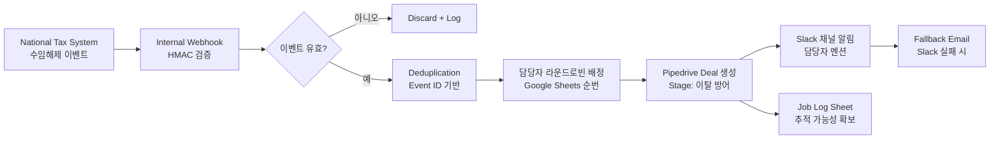
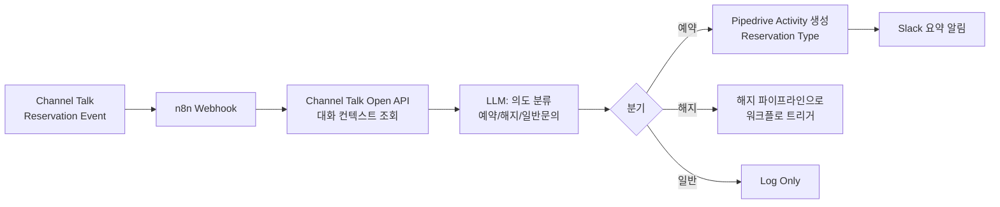
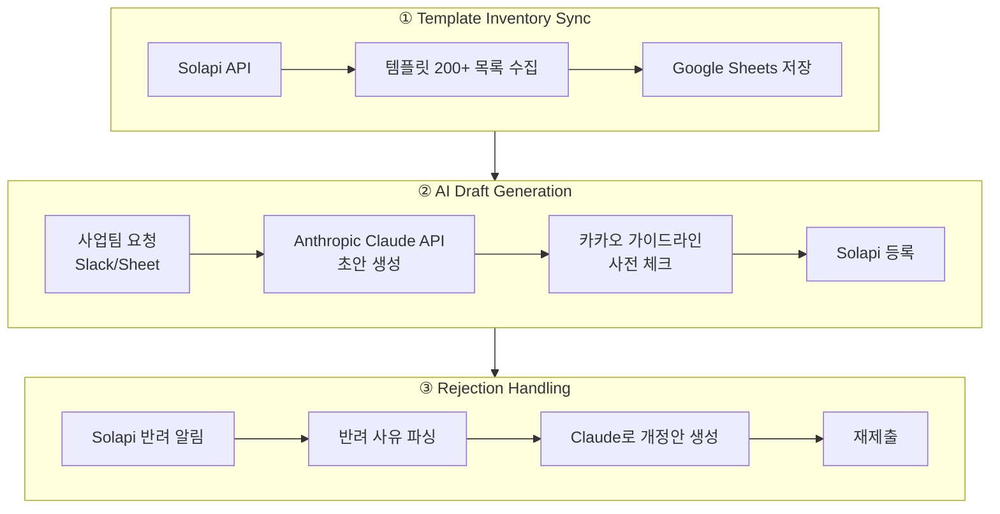
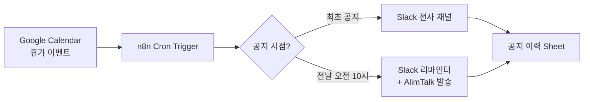

# n8n Self-hosted Workflows

**5개 프로젝트 · 9개 핵심 워크플로 · 15종 계정 통합 운영**

Zapier로 못 하는 복잡한 파이프라인을 위해 n8n self-hosted 서버를 직접 운영해 세일즈·CS 자동화를 구축했습니다.

> **ISMS 준수 안내**: 원본 워크플로 JSON은 회사 자산이자 개인정보·마케팅 문구를 포함하므로 이 저장소에 포함하지 않았습니다. 아래 문서는 설계 감각을 확인하기 위한 아키텍처 요약이며, 실제 워크플로 상세는 면접 시 화면 공유로 시연 가능합니다.

## 왜 n8n Self-hosted?

| 요구 | Zapier | n8n self-hosted |
|------|--------|-----------------|
| 복잡한 조건 분기 | 제약 있음 | 자유 |
| Task 원가 | 사용량 기반 (비쌈) | 서버 원가만 |
| 데이터 잔류 | Zapier 서버 | 자사 서버 |
| 커스텀 코드 | Code step 제약 | 완전 자유 (JS Function 노드) |
| Webhook 검증 (HMAC) | 제약 있음 | 완전 커스터마이징 |

세일즈 파이프라인 특성상 **높은 처리량 + 개인정보 잔류 최소화**가 필요해 n8n을 선택.

## 보안 설계 (self-hosted 공통)

- **접근 제어**: Cloudflare Access + 이메일 도메인 제한
- **웹훅 검증**: 서명 헤더(HMAC) 필수
- **크레덴셜**: n8n Credential Store, export 시 자동 제외
- **로그**: 페이로드 원본 24시간, 이후 요약만 잔류

---

## 대표 워크플로 1: Contract Termination Detection Pipeline

**이탈 신호 자동 감지 → CRM 딜 생성 → 담당자 라우팅 → Slack 리포트**

### 문제
세무 기장 구독 서비스에서 국세청 시스템(National Tax System)에서 고객이 세무대리인 수임을 해제하는 순간이 곧 해지 임박 신호. 이걸 사람이 눈으로 확인하는 구조로는 대응 속도가 늦어 방어 기회를 놓치고 있었습니다.

### 아키텍처

### 결과 (파이프라인이 지원한 사업 성과)
- 취소방어 시도 **89건 → 22건 성공** (성공 환급액 **₩3.61억**, Pipedrive 구간)
- Salesforce 구간 통합 시 **45건 성공, ₩7.5억**
- 방어 리드 누락 0건

---

## 대표 워크플로 2: Channel Talk → CRM Sync Pipeline

**채널톡에서 발생한 특정 이벤트(예약 저장·해지 문의)를 즉시 CRM으로 동기화**

### 문제
채널톡 상담 중 예약 저장이나 해지 관련 대화가 발생하면 CS 담당자가 별도로 CRM에 옮겨 담아야 했습니다. 이 반복이 하루 수십 건.

### 아키텍처

### 스택
Channel Talk Open API · n8n · Pipedrive · Slack · LLM (의도 분류)

---

## 대표 워크플로 3: AlimTalk Template Ops Pipeline

**Solapi 알림톡 템플릿 200개+ 관리 + Claude로 초안 자동 생성 + 반려 대응**

### 문제
알림톡 발송 종류가 10종+ (원천세·연말정산·법인세·결제·해지·환급 안내 등). 시즌마다 템플릿 개정 필요하고, 카카오 심사에서 반려되면 사유 분석·수정 반복. 이걸 사람이 다 하기엔 시간이 아까움.

### 아키텍처 (3단 파이프라인)

### 스택
Solapi API · Anthropic Claude · n8n · Google Sheets · Slack

### 결과
- 알림톡 **10종+** 자동 발송 파이프라인 안정 운영
- 시즌 개정 시 사업팀 요청 → 등록까지 리드타임 대폭 단축
- 반려 → 개정 → 재제출 사이클 자동화

---

## 대표 워크플로 4: HR Notification Automation

**공휴일·휴가 최초 공지 + 전날 리마인더 자동화** (내부 운영 지원)

### 문제
분산된 팀에 사내 공지가 늦게 전달돼 업무 혼선. 특히 휴가 최초 공지 후 실제 전날 리마인더가 자주 누락.

### 아키텍처

---

## 운영 규모 요약

| 항목 | 수치 |
|------|------|
| 활성 프로젝트 수 | 5 |
| 핵심 워크플로 수 | 9 |
| 연동 계정 종류 | 15 |
| 대응 이벤트 유형 | 30+ |

## 왜 이 문서에 원본 JSON이 없는가

ISMS 정보보호 원칙을 준수하기 위함입니다. n8n 워크플로 JSON에는:
- 회사 서비스 브랜드·마케팅 문구
- 발신 번호·팀원 담당 매핑
- 카카오 알림톡 템플릿 원문
- 회사 내부 프로세스 명

같은 정보가 남을 수 있어 개인 GitHub에 공개하지 않았습니다. 채용팀장 요청 시 **면접에서 화면 공유로 워크플로 실물을 시연**할 수 있습니다.
