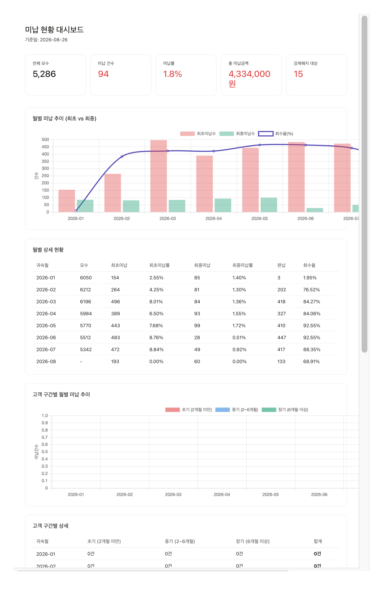

# Care Unpaid Dashboard

주간 미납 CSV를 업로드하면 사업자번호 그룹화·월별 탭 자동 적재·완납/강제해지 상태 자동 처리·Chart.js 대시보드·슬랙 주간 리포트까지 원스톱으로 처리하는 GAS 도구.

> 웹 대시보드 예시 (2026-08-26 기준) · 모수 5,286 · 미납 94건 · 미납률 1.8% · 강제해지 대상 15건 · 귀속월별 최초/최종 미납 추이와 회수율 라인 · 고객 구간별(초기·중기·장기) 세그먼트 분포

## 문제
기장 구독 고객의 미납 관리에서 (1) 원본 CSV 수작업 정리, (2) 사업자별 미납개월수 눈으로 판단, (3) 주간 리포트 수동 작성 세 지점이 병목이었습니다.

## 기능
- CSV 업로드 → 사업자번호 기준 그룹화 → 미납현황·월별 탭 자동 갱신
- 강제해지 자동 감지 (3개월+ 미납 → 예정 등록 → 확정 시 완료로 승격)
- 월별 탭 완납·강제해지 상태 자동 처리 (귀속월 이동/canceled 감지 로직 포함)
- 고객 세그먼트 분류 (초기·중기·장기)
- Chart.js 웹 대시보드 (귀속월별 최초·최종 미납률, 회수율 라인)
- 고객 이력 조회 (현재 미납 + 월별 이력 + 블랙리스트 여부)
- 슬랙 주간 리포트 (매주 화요일 17시 자동 발송, 신규 미납은 스냅샷 비교)

## 스택
Google Apps Script · Google Sheets · Chart.js (Web App) · Slack Webhook · Time-driven Trigger

## 파일
- `Code.gs` — 미납 파이프라인·블랙리스트·대시보드·웹앱 (982줄)
- `WeeklyReport.gs` — 슬랙 주간 리포트 (독립 네임스페이스)
- `appsscript.json` — 매니페스트 (파일 없음, 시트 프로젝트에서 직접 배포)

## 보안 (ISMS 준수)
원본 코드에는 사업자번호 5건과 담당자 실명이 하드코딩되어 있었습니다. 저장소에는 마스킹된 버전만 포함:
- `EXCLUDE_BIZ_NO`: 예시 주석으로 대체
- `EXCLUDED_MANAGERS`: `EXCLUDED_MANAGER_A`·`EXCLUDED_MANAGER_B`
- `DASHBOARD_URL`: Script Properties로 이동
- 슬랙 webhook URL: `WEEKLY_REPORT_WEBHOOK_URL` Script Properties
