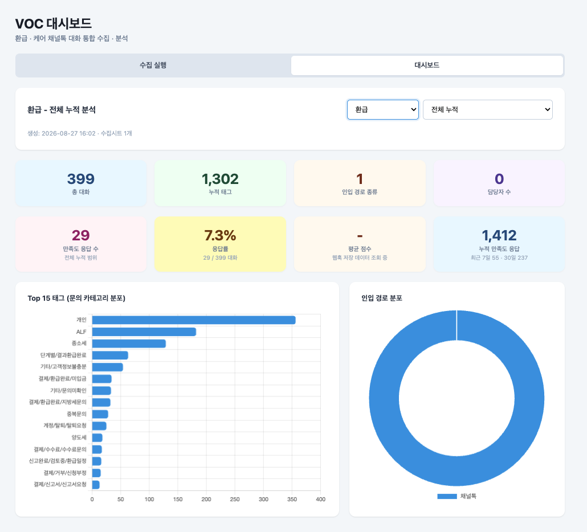
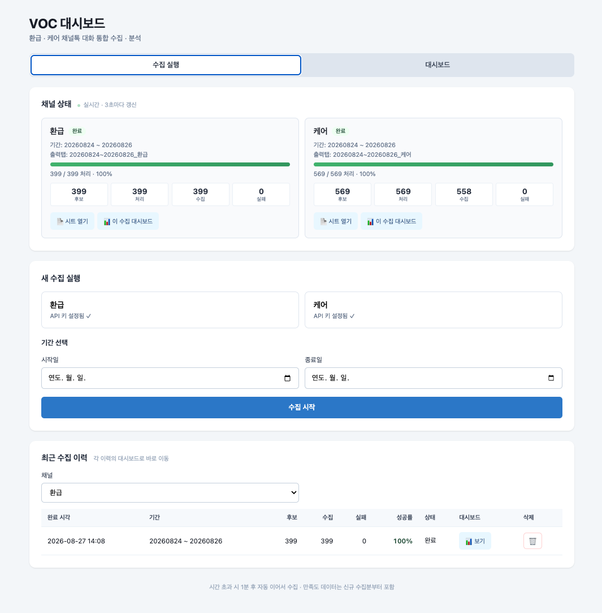

# Channel Talk VOC Dashboard

채널톡 상담 데이터를 집계 단위로 수집·분류하고, 주요 해지 사유와 반복 문의 유형을 대시보드화하는 GAS 웹앱. 민감정보를 제외한 발화 기반 분석으로 CX·운영 개선 논의에 활용합니다.

> 환급 채널 누적 예시 · 총 대화 399 · 누적 태그 1,302 · 태그 Top 15 및 인입경로 분포 · 만족도 응답 자동 매칭 (민감 응답 내용은 대시보드에서 제외)

> 채널별 수집 상태 실시간 표시 · 완료 후 대시보드로 바로 이동 · 최근 수집 이력 관리

## 문제
CS 대화가 채널톡에 쌓이는 속도가 팀 분석 속도를 앞질렀습니다. 해지·클레임 사유와 반복 문의 유형이 담당자 감에만 의존해 파악되는 상태였고, 대시보드 없이 시트로만 관리되어 CX·운영 개선 근거를 만들기 어려웠습니다.

## 기능
- **환급·케어 채널 통합 수집** — 각 채널을 병렬로 처리하고 진행 상태를 실시간 표시
- **집계 단위 분석** — 태그 Top 15 · 인입경로 분포(카카오/채널톡/미트) 등 문의 카테고리 구조화
- **만족도 응답 자동 매칭** — VOC 대시보드에서 응답자 규모와 응답률만 집계 (개별 응답 내용은 대시보드에서 제외)
- **수집 이력 관리** — 완료된 수집 별 시트/대시보드 링크와 통계 유지
- **개인정보 최소화** — 원본 대화의 개인정보는 팀 내부 시트에만 저장

## 스택
Google Apps Script (Web App) · Channel Talk Open API · Google Sheets · Chart.js · Time-based Triggers · LockService · PropertiesService

## 파일
- `code.gs` — 서버 로직 (수집 파이프라인·집계·대시보드 데이터 프로바이더)
- `dashboard.html` — 대시보드 UI (수집 실행 화면 + 분석 대시보드)
- `appsscript.json` — 매니페스트

## 보안 (ISMS 준수)
- Access Key/Secret: Script Properties 관리
- 채널 slug·그룹 ID 등 워크스페이스 식별자: 저장소 버전에서 마스킹 (`<REFUND_SLUG>` · `<CARE_SLUG>` · `<SATISFACTION_GROUP_ID>`)
- 원본 대화의 개인정보는 팀 내부 시트에만 저장, 저장소에는 포함하지 않음
- 대시보드는 집계 지표(태그 분포·인입경로·응답 규모)만 표시하도록 설계
