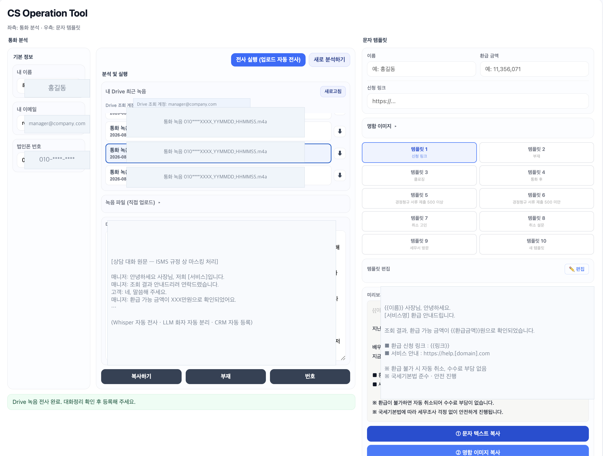

# CS Operation Tool

콜 후처리를 자동화하는 사내 GAS 웹 앱. 통화 녹취를 Whisper로 전사하고 LLM으로 화자를 분리한 뒤, 내부 권한 사용자에 한해 CRM 활동 기록으로 등록되도록 설계했습니다.

> 담당자 정보 → Drive 녹취 자동 조회 → Whisper 전사·LLM 화자 분리 → 상담 요약 → CRM 자동 등록 및 문자 템플릿 발송까지 원-스톱 처리 (개인정보·브랜드명·URL은 ISMS 규정에 따라 마스킹)

## 문제
세일즈 콜 이후 CRM에 상담 내용을 기록하는 작업이 병목이었습니다. 콜 1건당 사후 처리에 평균 3분 30초가 소요되고 있었습니다.

## 기능
- Google Drive 담당자별 녹취 폴더 자동 탐색
- Whisper API로 음성 → 텍스트 변환
- LLM으로 매니저·고객 발화 자동 구분
- Pipedrive Activity 자동 등록 (Deal/Lead 모두 지원)
- 다중 CRM 계정 토큰 분기 (담당 서비스별)
- 사용자 권한 관리 (USERS 시트)

## 스택
Google Apps Script (Web App) · Whisper (Groq) · LLM · Pipedrive API v2 · Google Drive API

## 파일
- `Code.gs` — 서버 로직 (1,006줄)
- `Index.html` — 웹 앱 UI
- `appsscript.json` — 매니페스트

## 보안
- API 키·토큰: `PropertiesService.getScriptProperties()` 관리
- 사용자 인증: `USERS` 시트 등록 이메일만 허용
