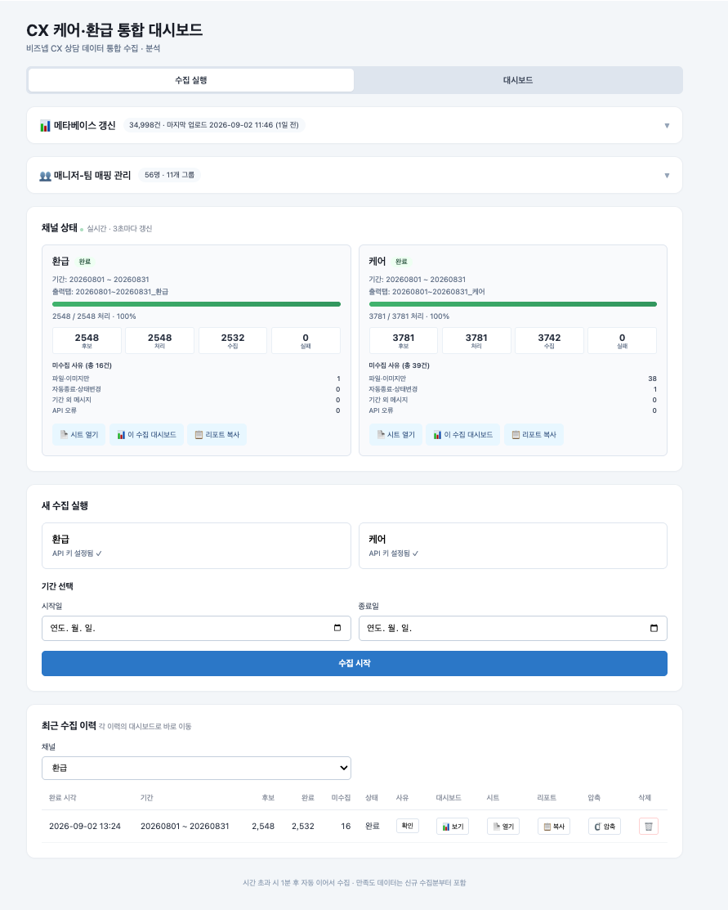
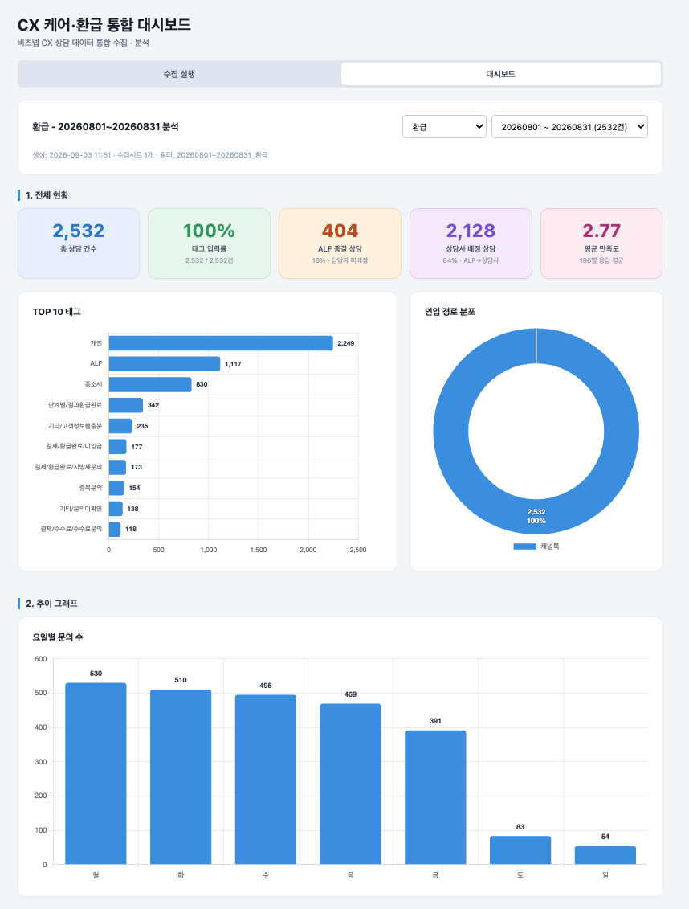
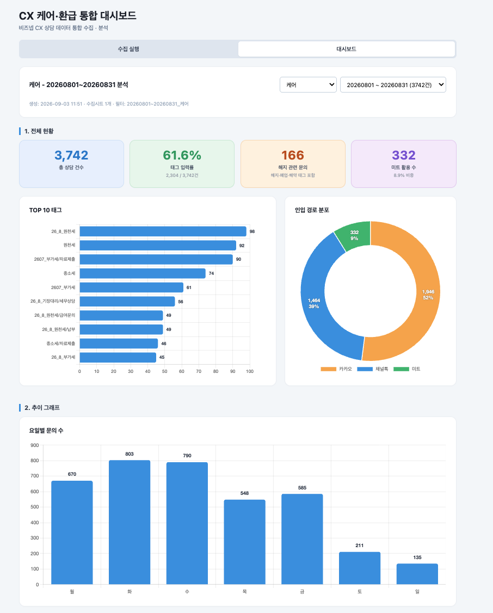
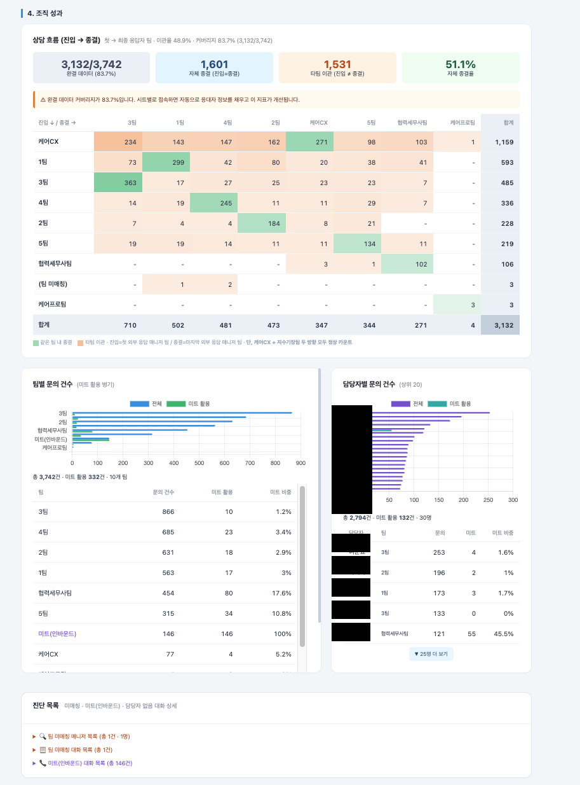
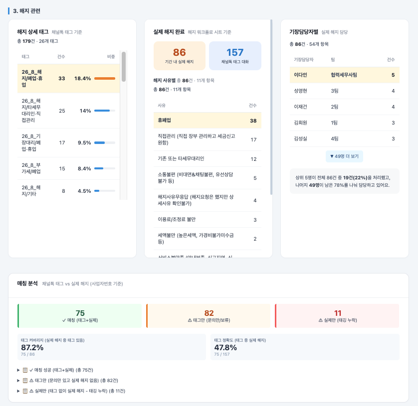
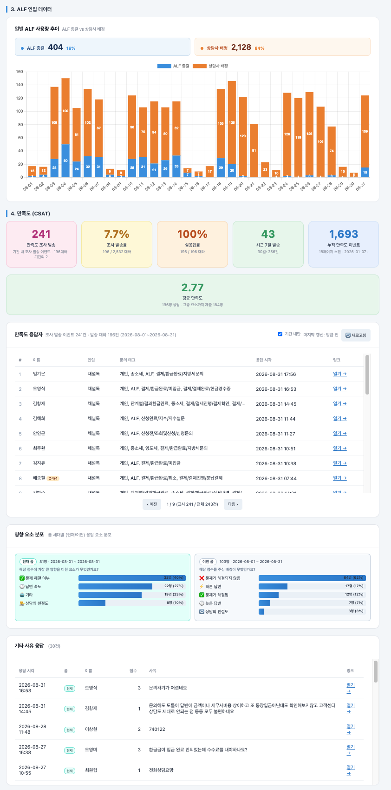
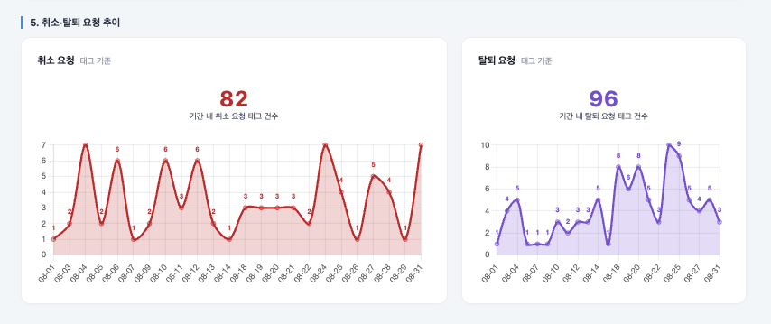

# CX 케어·환급 통합 대시보드

환급·케어 두 채널의 채널톡 상담 데이터를 한 웹앱에서 수집·분석하는 GAS 웹앱. 태그·인입경로·조직 성과·해지 매칭·ALF/CSAT까지 CX 운영 지표를 통합해 표시합니다. (구 Channel Talk VOC Dashboard 전면 개편)

> 수집 실행 탭 · 환급 2,548건 / 케어 3,781건 100% 처리 · 3초 실시간 채널 상태 · 메타베이스 갱신 34,998건 · 매니저-팀 매핑 56명 11개 그룹 관리

> 환급 대시보드 · 총 상담 2,532건 · ALF 종결 404(16%) · 상담사 배정 2,128(84%) · 평균 만족도 2.77 · TOP 10 태그 및 요일별 문의 분포

> 케어 대시보드 · 총 상담 3,742건 · 태그 입력률 61.6% · 해지 관련 문의 166건 · 인입 경로 3분할 (카카오 52% / 채널톡 39% / 미트 9%)

> 조직 성과 탭 · 상담 흐름 (최초 응대 → 최종 응대) 히트맵 · 자체 종결율 51.1% · 타팀 이관 1,531건 · 팀별·담당자별 문의 건수(미트 활용 병기) · 진단 목록(팀 미매칭·미트 인바운드·담당자 없음)
> · 담당자 실명은 마스킹 처리

> 케어 전용 해지 섹션 · 채널톡 해지 태그 179건(26개 태그) · 워크플로 시트 기준 실제 해지 86건 · 기장담당자별 해지 분포 · 태그 커버리지 87.2% · 태그 정확도 47.8%

> 환급 전용 · 일별 ALF 종결 vs 상담사 배정 추이 · CSAT 발송 241건·실응답 100%·평균 만족도 2.77 · 폼 세대별 영향 요소 분포 · 기타 사유 자유응답 리스트

> 환급 채널 취소 82건 / 탈퇴 96건 (기간 내 태그 기준) · 일별 트렌드

## 문제

환급·케어 두 채널의 채널톡 상담 데이터가 서로 다른 방식으로 관리되고 있었습니다. 기존에는 대화 원자료 수집·태그 집계·해지 매칭·조직 성과·CSAT 분석이 각각 다른 시트와 스크립트에 흩어져 있어, 채널·기간별 지표를 한 화면에서 비교하기 어려웠습니다. 매니저-팀 매핑도 스프레드시트에 수기로 관리되어 조직 개편 시마다 반영이 늦었습니다.

## 해결

- **한 웹앱, 두 채널** — 환급/케어 API 키를 채널별로 분리해 병렬 수집·분석. 채널별 프로퍼티 키(`CT_JOB_refund_*`, `CT_JOB_care_*`)로 잡 상태 관리
- **수집 실행 ↔ 대시보드** 2탭 구조
- **자동 이어서 수집** — 실행 4.5분 근접 시 GAS 트리거로 다음 배치 자동 예약. 시간 초과·타임아웃 자동 복구
- **스냅샷 시스템** — 수집 완료 시점의 대시보드/CSAT JSON을 별도 시트에 저장. 원자료 시트를 삭제(또는 압축)해도 뷰가 완전히 유지됨
- **매니저-팀 매핑 UI** — 웹앱 내에서 추가·수정·삭제·검색. 채널톡 팀 API와 스프레드시트 매핑을 조합해 조직 성과 지표 계산

## 기능

### 수집 실행 탭
- **메타베이스 갱신** — Metabase에서 다운로드한 CSV/JSON 업로드 → `메타베이스` 탭 전체 교체 + 필수 헤더 자동 검증
- **매니저-팀 매핑 관리** — 검색·CRUD UI. 채널톡 팀 API 자동 동기화 + 로컬 오버라이드
- **채널 상태 실시간** — 3초마다 갱신, 후보/처리/수집/실패 카운트 + 미수집 사유 분류 (파일·이미지만/자동종료·상태변경/기간 외 메시지/API 오류)
- **새 수집 실행** — 채널 선택 + 기간 지정 + `수집 시작`. API 키 세팅 여부 자동 표시
- **최근 수집 이력** — 각 이력에서 대시보드/시트/리포트/압축(스냅샷)/삭제 원클릭 이동

### 대시보드 탭 (공통)
- **1. 전체 현황** KPI — 총 상담 건수 · 태그 입력률 · 채널별 특화 KPI
- **TOP 10 태그** · **인입 경로 분포** (카카오/채널톡/미트)
- **2. 추이 그래프** — 요일별 문의 수
- **4. 조직 성과** — 상담 흐름 히트맵(진입 팀 → 종결 팀) · 팀별/담당자별 문의 건수(미트 활용 병기) · 진단 목록(팀 미매칭 매니저/대화, 미트 인바운드, 담당자 없음)

### 케어 채널 전용
- **해지 상세 태그** (채널톡 태그 기준) · **실제 해지 완료** (외부 해지 워크플로 시트 기준) · **기장담당자별 실제 해지 담당**
- **매칭 분석** — 채널톡 태그 vs 실제 해지 사업자번호 매칭 (커버리지/정확도)

### 환급 채널 전용
- **3. ALF 인입 데이터** — ALF 종결 vs 상담사 배정 일별 추이
- **4. CSAT** — 발송 건수 · 발송률 · 실응답률 · 최근 7일 · 누적 이벤트 · 평균 만족도 · 폼 세대별 영향 요소 · 기타 사유 자유응답
- **5. 취소·탈퇴 요청 추이** — 태그 기준 일별 트렌드

### 자동화·보조
- **워크플로우 웹훅 수신** — `doPost`로 채널톡 만족도 응답 수신 → `만족도_웹훅` 시트 적재 (Secret 토큰 검증)
- **자체 CSV 다운로더** — 리포트 텍스트/시트 압축(JSON) 원클릭 export
- **Groq 기반 VOC 자동 분류** (파일럿) — 대화 내용을 유형별로 분류 · 배치 처리

## 스택

Google Apps Script (Web App · V8) · Channel Talk Open API v5 · Google Sheets · Chart.js 4 + chartjs-plugin-datalabels · Time-based Triggers · LockService · PropertiesService · Groq API (VOC 파일럿)

## 파일

- `code.gs` — 서버 로직 (약 6,600줄, 수집 파이프라인·집계·매핑·스냅샷·CSAT 웹훅 수신·VOC 분류)
- `dashboard.html` — 프론트 (약 3,400줄, 수집 실행/대시보드 2탭 SPA)
- `appsscript.json` — 웹앱 매니페스트 (`ANYONE_ANONYMOUS` · `USER_DEPLOYING`)

## 규모 (실운영 기준 · 2026-08 스냅샷)

- 처리 대상: 환급 2,548 대화 / 케어 3,781 대화 (월간)
- 메타베이스 인덱스: 34,998행
- 매니저-팀 매핑: 56명 / 11개 그룹
- 자동 이어서 수집: 실행 4.5분 근접 시 트리거 예약 → 무제한 기간 수집 가능
- 스냅샷: 수집 시점 대시보드/CSAT JSON을 셀 45KB × 3청크로 분산 저장

## 보안 (ISMS 준수)

저장소에는 **원문 대화, 고객 식별정보, 워크스페이스 식별자, 매니저 실명·이메일, 인증 정보가 포함되어 있지 않으며**, README에는 집계 결과와 구현 구조만 요약했습니다.

- Access Key/Secret: Script Properties 관리 (저장소 미포함)
- 채널 slug·그룹 ID·해지 워크플로 시트 ID 등 워크스페이스 식별자: 저장소 버전에서 마스킹 (`<REFUND_SLUG>` · `<CARE_SLUG>` · `<SATISFACTION_GROUP_ID>` · `<CANCEL_WF_SHEET_ID>`)
- 매니저-팀 초기 세팅 (`setupManagerTeamMappingManual`)의 실제 인원·이메일 리스트는 마스킹 (`<MGR_N>` · `<TEAM_A/B/CX/...>` 형태)
- 매니저 오버라이드 맵(`MGR_TEAM_OVERRIDES`)도 마스킹
- 원문 대화·개인정보는 저장소에 포함하지 않고, 대시보드는 집계·시각화 지표만 표시
- 스크린샷 중 담당자 실명이 노출되는 영역(조직 대시보드의 담당자별 문의 건수 차트·표)은 마스킹 처리
